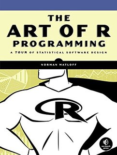
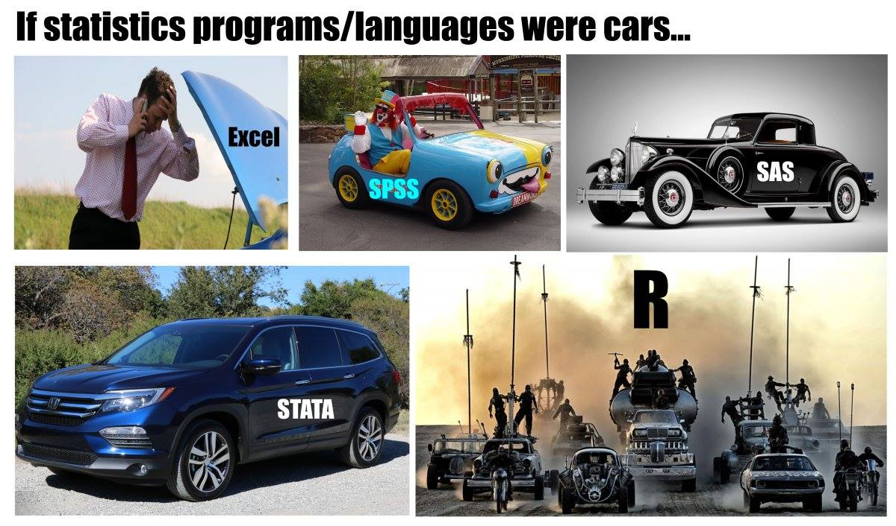
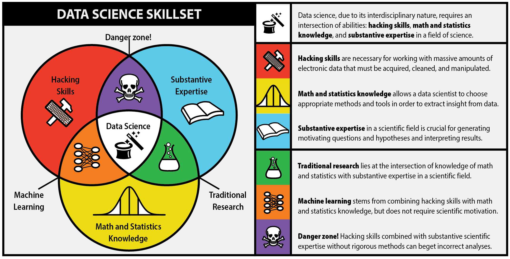
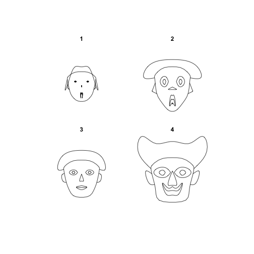

<style>
.section .reveal .state-background{
   background: brown;
}
</style>
<script src="http://cdn.mathjax.org/mathjax/latest/MathJax.js?config=TeX-AMS_HTML-full" type="text/javascript">
</script>

<script type="text/x-mathjax-config">
  MathJax.Hub.Config({
    "HTML-CSS": { scale: 100}
  });
</script>

Introducción al Análisis de Datos con R (v 1.0)
========================================================
width: 1440
height: 900
author: Alvaro Limber Chirino Gutierrez
date: Febrero 2017
transition: rotate
css: pres6.css
## Talleres de capacitación, Fundación ARU
### [achirino@aru.org.bo](mailto:achirino@aru.org.bo)

<p style="text-align:right;">

</p>


Outline
=======

- Fundación ARU
- Programa de Capacitación
  - Oferta 2017
- Introducción al Análisis de Datos con R
  * Objetivo
  * Perfil del participante
  * Estructura del curso
  * Organización de los modulos
  * Bibliografía
  
***

- Semana 1
  * Introducción a R
- Semana 2
  * Estadista básica
- Semana 3
  * Generación de indicadores




Fundación ARU
=====
type: section


¿Qué es ARU?
====

 Fundación ARU es un Instituto de Investigación de Políticas Públicas independiente, plural y sin fines de lucro. Tiene como objetivo proveer y promover investigación de calidad que informe e influencie el proceso de políticas públicas en Bolivia.

Enfoque Estratégico ARU

* Levantamiento de datos de calidad (UD).
* Reclutamiento y capacitación de jóvenes investigadores (UC).
* Desarrollo de agendas de investigación aplicada (UI).
* Informar e influir la política pública a partir de evidencia (UP).


Programa de capacitación
========
type: section

Fundación Aru planea poner en marcha desde este año su plan de capacitación continua, este plan contiene 3 estrategias de funcionamiento

* Escuelas de temporada
* Cursos a demanda 
* Una plataforma de enseñanza virtual.

Oferta 2017
========
* [SC01] **Curso Básico de Stata**
* [SC02] **Curso Intermedio de Stata**
* [SC03] **Curso Básico de  R**
* [SC04] **Curso Intermedio de Stata**
* [SC05] **Introducción al diseño de encuestas por muestreo**
* [SC06] **Tópicos avanzados en encuestas por muestreo**
* [SC07] **Diseño de cuestionarios**
* [SC08] **Elaboración de cuestionarios digitales**
* [SC09] **Introducción a la evaluación de impacto**
* [SC10] **Curso intermedio de evaluación de impacto**

***

* [SC11] **Diseños experimentales; teoría y practica**
* [SC12] **Inferencia causal**
* [SC13] **Pobreza y desigualdad: teoría y practica**
* [SC14] **Mercado laboral: teoría y practica**
* [SC15] **Indicadores educativos: teoría y practica**
* [SC16] **Gestión de datos en la investigación**
* [SC17] **Herramientas y pasos para la investigación**


Introducción al Análisis de Datos usando R
========================================================
type: section 

Este taller ofrece una introducción al lenguaje de programación del software estadístico R. Actualmente R ha ganado mucho atención en el campo del análisis de datos en general y particularmente en investigadores, en este curso se enfatiza aspectos relacionados al calculo de indicadores de bienestar. 


Objetivo del taller
====
El objetivo del curso es permitir a los participantes escribir su propio proyecto registrado en la sintaxis, que va desde la importación de los datos para la aplicación para de métodos estándar de análisis de datos y mas avanzados. Se espera que los participantes estén ya familiarizados con el análisis de datos en general e idealmente con algún otro software estadística como Stata, SPSS, etc. \\


Requisitos
====

* Alguna experiencia previa en el análisis de datos
* Familiaridad con métodos estadísticos básicos (medias, frecuencias, etc.)
* (idealmente) previa experiencia con algún software estadístico


Grupo meta
====
Los participantes encontrarán útil el taller si:

* Tienen que hacer un montón de análisis de datos, y crear gráficos o informes (estandarizados);
* necesitan un software estadístico de gran alcance en la mano para diversas tareas;
* quieren beneficiarse de las últimas implementaciones de algoritmos y métodos estadísticos;
* quieren ser parte de una comunidad de usuarios en rápido crecimiento;
* se han estado preguntando si R es difícil de aprender (No, no lo es!);

Se recomienda al grupo que culmine el taller otros talleres complementarios mas especializados; Diseño de investigación, Metodologías de encuestas, Evaluación de impacto, etc.

Estructura del curso
===
El taller se divide en 3 módulos de 10 horas cada uno de ellos, estos son;

* **Introducción a R** Este modulo esta destinado a aprender el lenguaje de R , entender el ambiente de trabajo, cómo importar y exportar datos de diferentes formatos, la gestión de datos, la estructura y uso de los objetos en R, como crear funciones, etc.
* **Estadista básica** En este modulo se abordan conceptos estadísticos básicos a ser desarrollados con el R, se abordan las estadísticas de tendencia central, de dispersión y forma, también, se incluye el trabajo con mas e una variable explorando correlaciones, test estadísticos, regresiones simples y múltiples. 	
* **Generación de indicadores** En base a lo desarrollado en los anteriores módulos, se concreta el análisis de datos en R introduciendo el manejo de las encuestas a hogares del Instituto Nacional de Estadística, generando indicadores de bienestar, se incluye el concepto de inferencia en el R y se culmina con una introducción a la generación de gráficos.

Organizacion de los modulos
===


* Introducción a R:
  * [Dia 1:] Estructura del software, RStudio, script, tipos de objetos y estructuras
  * [Dia 2:] Directorios de trabajo, comandos, ayuda,, librerías y loop
  * [Dia 3:] Importando y exportando diferentes fuentes de datos (excel, .tex, SPSS, etc)
  * [Dia 4:] Indexación, Familia Apply y creación de funciones
  * [Día 5:] Flujo de trabajo, investigación reproducible: Markdown, Knitr, Shiny.

***

* Estadista básica:
  * [Día 1:] Medidas de tendencia central y dispersión
  * [Día 2:] Estadísticas de forma, asociaciones y correlaciones de variables
  * [Día 3:] Test estadísticos
  * [Día 4:] Regresión simple
  * [Día 5:] Regresión múltiple
  
Organizacion de los modulos
===

* Generación de indicadores:
  * [Día 1:] Uso de la librería survey para el análisis de encuestas
  * [Día 2:] Calculo de indicadores de educación y empleo
  * [Día 3:] Calculo de indicadores de pobreza 
  * [Día 4:] Calculo de indicadores de desigualdad
  * [Día 5:] Introducción a Gráficos 


Bibliografía del curso
===
Se recomienda que los participantes consulten antes y durante el curso las siguientes referencias:

* An Introduction to R, W. N. Venables, D. M. Smith and the R Core Team
* Using R for Data Analysis and Graphics - Introduction, Examples and Commentary, John Maindonald
* Data Analysis with R, Tony Fischetti
* Handbook on Poverty and Inequality, Jonathan Haughton, Shahidur R. Khandker


Acerca del curso
====

* **Duración:** 30 Horas
* **Facilitador:** Alvaro Chirino
* **Dias:** 6 al 24 de Febrero
* **Horario:** 8:00 - 10:00
* **Certificación:** 100\% de asistencia 
* **Asistencia técnica:** Efrain Candia


Reglas del curso
===

* Hay una tolerancia de 10 minutos al inicio de la sesión  
* Es necesario una computadora personal
* La ultima hora se destina a ejercicios en aula

Herramientas
===
* **Material:** Se compartira una carpeta en dropbox: la carpeta IntroR\_Aru, contiene; presentaciones, bases de datos, bibliográfica
* **Internet:** De ser necesario se habilitara 
* **Red local:** (Pendiente)
* **Folders:** Llenar su perfil y la hoja de evaluación (el ultimo día)

Empecemos...
=====
type: section

Presentación y expectativas.

Semana 1
===

- ¿Qué es R?, algo de historia y usos
- R-Studio
- Instalación
- R Básico
  - Comandos (help), valores especiales
  - Librerias
  - Asignación
  - Tipos de Objetos
  - Estructuras
  - Loops
  - Indexación
  
  ***

- Creación de Funciones
- La familia apply
- Investigación reproducible, programing literacy: Markdown, knitr, Shiny

Comparación perfecta
===


Data science
========================================================




Algo de historia de R
========================================================

- R es el hermano de S
- S es un leguaje de programacion estadistica desarrollado por John Chambers de Bell Labs
- El objetivo de S era "convertir las ideas en el software, de forma rápida y fielmente"
- S fue creado en 1976 y se reinvento 1988 introduciendo muchos cambios
- En 1993, StatSci (fabricante de S-Plus) adquieren licencia exclusiva a S
- S-Plus integra S con una interfaz gráfica de usuario agradable y pleno apoyo al cliente
- R Fue creado por Ross Ihaka y Robert Gentleman de la University of Auckland, New Zealand

R
===
- El proyecto R inicio en 1991
- R apareció por primera vez en 1996 como un software de código abierto!
- **Altamente personalizable a través de paquetes**
- La comunidad R, se basa en el poder de la colaboración con miles de paquetes de libre disposición
- Existen muchas interfaces gráficas de usuario de R libres y comerciales (por ejemplo *R Studio* y Revolución)

¿Qué es R?
==========
R es un conjunto integrado de servicios de software para la manipulación de datos, cálculo y representación gráfica. Incluye:
- instalacion sencilla y un facil almacenamiento de datos
- un conjunto de operadores para los cálculos en arrays, particularmente en las matrices
- facilidad en los gráficos y el analisis de datos y
- bien desarrollado, lenguaje de programación sencillo y eficaz que incluye condicionales, bucles, funciones recursivas definidos por el usuario.
- Altamente intuitivo

R en the NY Times
=================

A pesar de **ser libre** y de código abierto, R es ampliamente utilizado por los analistas de datos dentro de las empresas y el mundo académico.

Ver [NY Times](http://www.nytimes.com/2009/01/07/technology/business-computing/07program.html?pagewanted=all&_r=0) articulo


Algunas referencias
===============

Algunas referencias para empezar:
- [aRrgh: a newcomer's (angry) guide to R](http://tim-smith.us/arrgh/) by Tim Smith and Kevin Ushey
- [Introductory Statistics with ](http://www.amazon.com/Introductory-Statistics-R-Computing/dp/0387790535) by Peter Dalgaard
- R tarjeta de comandos http://cran.r-project.org/doc/contrib/Short-refcard.pdf
- Tutorial de R http://www.cyclismo.org/tutorial/R/
- [R project](http://r-project.org) and [Bioconductor](bioconductor.org)

Mas avanzado:

- [Hadley Wickham's book](http://adv-r.had.co.nz/)


RStudio
=======
type: section

[RStudio](http://www.rstudio.com/) es un ambiente libre y abierto de desarrollo de código integrado. 


-------------
- multiplataforma
- El resaltado de sintaxis, completado de código, y la sangría inteligente
- gestionar fácilmente múltiples directorios de trabajo 
- Flexible para el manejo de gráficos
- Integrado con Knitr
- Integrado con Git

Intalación
============

1. R-CRAN https://cran.r-project.org/ (elija el Sistema operativo, descargue y siguiente, siguiente...)
2. R-Studio https://www.rstudio.com/  (elija el Sistema operativo, descargue y siguiente, siguiente...)

**Nota:**

Para actulizar ambos paquetes: descargue la nueva versión e instalela (las librerias no sufren cambios). 

R básico
========
type: section

R es una calculadora demasiado grande
==============

```r
2+2
```

```
[1] 4
```

```r
exp(-2)
```

```
[1] 0.1353353
```

```r
pi
```

```
[1] 3.141593
```

```r
sin(2*pi)
```

```
[1] -2.449294e-16
```

Como entiende R los comandos
============

**comando(argumentos, argumentos,...)**

*Advertencia*

- No es posible resumir un comando
- R distingue mayuscula de minuscula
- Siempre cerrar los parentesis
- R entiende el orden de los argumentos o su nombre clave

Obteniendo ayuda
============


```r
help(pi) # equivalent ?pi
?sqrt
?sin
?Special
```

Si no conoces el nombre exacto:

```r
help.search("trigonometry")
??trigonometry
apropos("test")
```

```
 [1] ".valueClassTest"         "ansari.test"            
 [3] "bartlett.test"           "binom.test"             
 [5] "Box.test"                "chisq.test"             
 [7] "cor.test"                "file_test"              
 [9] "fisher.test"             "fligner.test"           
[11] "friedman.test"           "kruskal.test"           
[13] "ks.test"                 "mantelhaen.test"        
[15] "mauchly.test"            "mcnemar.test"           
[17] "mood.test"               "oneway.test"            
[19] "pairwise.prop.test"      "pairwise.t.test"        
[21] "pairwise.wilcox.test"    "poisson.test"           
[23] "power.anova.test"        "power.prop.test"        
[25] "power.t.test"            "PP.test"                
[27] "prop.test"               "prop.trend.test"        
[29] "quade.test"              "shapiro.test"           
[31] "t.test"                  "testInheritedMethods"   
[33] "testPlatformEquivalence" "testVirtual"            
[35] "var.test"                "wilcox.test"            
```

Palabras reservadas y simbolos especiales de R
=========================

- NA: datos perdidos
- NULL: datos nulos
- Inf -Inf: Infinito
- #: comentario
- TRUE (T), FALSE (F): valores lógicos

***

- NaN: not a number
- ?: Ayuda
- + x
- x, ,x + y, x - y ,x * y ,x / y ,x ^ y (**),x %% y (mod) ,x %/% y (div int)
- ! x, .x & y ,x && y ,x | y ,x || y

Librerias
==========

Instalar una libreria

**install.packages("Nombre de la libreria")**
**install.packages("Nombre de la libreria",dependencies="Depends")**

*Ejemplo*

install.packages("TeachingDemos")


```r
####Habilitar la libreria
library(TeachingDemos)
####Comandos de la libreria
library(help=TeachingDemos)
```
--------------------

```r
####Algunos comandos
faces(rbind(1:3,5:3,3:5,5:7))
```




Asignación
==========

Almacenando resultados intermedios.


```r
x1 <- 1
x2 <<- 2
3 -> x3
4 ->> x4
x5 = 5
```

Trate de usar nombres significativos!
Miren esto:
- [Hadley Wickham's book](http://adv-r.had.co.nz/)
- [Google's coding standards](http://google-styleguide.googlecode.com/svn/trunk/Rguide.xml)


Tipos de objetos
===========================


```r
y1<-2
y2<-2.5
y3<-TRUE
y4<-"Hola"
y5<-NULL
```
-------------------

```r
typeof(y1);typeof(y2);typeof(y3);
```

```
[1] "double"
```

```
[1] "double"
```

```
[1] "logical"
```

```r
mode(y4);mode(y5)
```

```
[1] "character"
```

```
[1] "NULL"
```

Vectores
========================================================
No podemos hacer mucho estadísticas con un solo número!

Necesitamos una forma de almacenar una secuencia / lista de números

Uno puede simplemente concatenar los elementos con la función `c`.


```r
weight <- c(60, 72, 75, 90, 95, 72)
height <- c(1.75, 1.80, 1.65, 1.90, 1.74, 1.91)
bmi <- weight/height^2 # vector based operation
bmi
```

```
[1] 19.59184 22.22222 27.54821 24.93075 31.37799 19.73630
```
- El trabajo con vectores es mucho mas facil y rapido
- `c` puede ser usado para unir números y cadenas

Tipos de estructuras
========================================================

Incluso los vectores pueden ser limitados y necesitamos estructuras más poderosas

**Homogeneas:**
- Vectores (1-d)
- Matrices (2-d)
- Arrays (n-d)

Pueden ser valores lógicos, números o cadenas

**Heterogeneas:**
- Listas (list)
- Marcos de datos (dataframes)

Para mas detalles: [http://adv-r.had.co.nz/Data-structures.html](http://adv-r.had.co.nz/Data-structures.html)

Vectores
=======

Tres tipos de vectores

```r
# Numeric vectors
x <- c(1, 5, 8)
x
```

```
[1] 1 5 8
```

```r
# Logical vectors
x <- c(TRUE, TRUE, FALSE, TRUE)
x
```

```
[1]  TRUE  TRUE FALSE  TRUE
```

```r
# Character vectors
x <- c("Hello", "my", "name", "is", "Francis")
x
```

```
[1] "Hello"   "my"      "name"    "is"      "Francis"
```

Matrices y arrays (1/2)
===================

Una matriz es una arreglo bidimensional de números. Las matrices se pueden utilizar para realizar operaciones (álgebra lineal). Sin embargo, también se pueden utilizar como tablas. 


```r
x <- 1:12
length(x)
```

```
[1] 12
```

```r
dim(x)
```

```
NULL
```

```r
dim(x) <- c(3, 4)
x
```

```
     [,1] [,2] [,3] [,4]
[1,]    1    4    7   10
[2,]    2    5    8   11
[3,]    3    6    9   12
```
--------

```r
x <- matrix(1:12, nrow=3, byrow=TRUE)
x <- matrix(1:12, nrow=3, byrow=FALSE)
rownames(x) <- c("A", "B", "C")
colnames(x) <- c("1", "2", "x", "y")
x <- matrix(c(9,8,7,6), 2,2)
x
```

```
     [,1] [,2]
[1,]    9    7
[2,]    8    6
```

Matrices y Arrays (2/2)
===================

Las matrices pueden conformarce a partir de vectores


```r
x1 <- 1:4
x2 <- 5:8
y1 <- c(3, 9)
my_matrix <- rbind(x1, x2)
new_matrix <- cbind(my_matrix, y1)
new_matrix
```

```
           y1
x1 1 2 3 4  3
x2 5 6 7 8  9
```
-------------
Arrays, n-dimensiones

```r
array(1:27, c(3, 3, 3))
```

```
, , 1

     [,1] [,2] [,3]
[1,]    1    4    7
[2,]    2    5    8
[3,]    3    6    9

, , 2

     [,1] [,2] [,3]
[1,]   10   13   16
[2,]   11   14   17
[3,]   12   15   18

, , 3

     [,1] [,2] [,3]
[1,]   19   22   25
[2,]   20   23   26
[3,]   21   24   27
```

Listas
=====
Las listas pueden ser utilizados para almacenar objetos (posiblemente de diferentes tipos / tamaños) en un objeto compuesto más grande.

```r
x <- c(31, 32, 40)
y <- c("F", "M", "M", "F")
# Diferentes tipos y dimensiones
z <- c("London", "School")
my_list <- list(age=x, sex=y, meta=z)
my_list
```

```
$age
[1] 31 32 40

$sex
[1] "F" "M" "M" "F"

$meta
[1] "London" "School"
```

Data Frames
==========
Es una "matriz de datos" o un "conjunto de datos". Es una lista de vectores y / o factores de la misma longitud que están relacionadas "a través" de tal manera que los datos en la misma posición provienen de la misma unidad experimental (sujeto, genes, etc.).


```r
my_df <- data.frame(age=c(31, 32, 40, 50), sex=c("M", "M", "F", "M"))
my_df
```

```
  age sex
1  31   M
2  32   M
3  40   F
4  50   M
```
¿Por qué necesitamos dataframes si es simplemente una lista?
- indexación y almacenamiento más eficiente!

Indexación (1/3)
========

La indexación es una gran manera de acceder directamente a los elementos de interés.


```r
# Indexing a vector
pain <- c(0, 3, 2, 2, 1)
pain[1]
```

```
[1] 0
```

```r
pain[2]
```

```
[1] 3
```

```r
pain[1:2]
```

```
[1] 0 3
```
----------

```r
pain[c(1, 3)]
```

```
[1] 0 2
```

```r
pain[-5]
```

```
[1] 0 3 2 2
```
Tenga en cuenta que con un dataframe, la indexación de las unidades es sencillo!

Indexación (2/3)
================


```r
# Indexing a matrix
my_matrix[1, 1]
```

```
x1 
 1 
```

```r
my_matrix[1, ]
```

```
[1] 1 2 3 4
```

```r
my_matrix[, 1]
```

```
x1 x2 
 1  5 
```

```r
my_matrix[, -2]
```

```
   [,1] [,2] [,3]
x1    1    3    4
x2    5    7    8
```
----------

```r
# Indexing list is done in the same way
my_list[3]
```

```
$meta
[1] "London" "School"
```

```r
my_list[[3]]
```

```
[1] "London" "School"
```

```r
my_list[[3]][1]
```

```
[1] "London"
```

```r
# Indexing a data frame
my_df[1, ]
```

```
  age sex
1  31   M
```

```r
my_df[2, ]
```

```
  age sex
2  32   M
```


Indexación por nombre (3/3)
================


```r
my_list$age
```

```
[1] 31 32 40
```

```r
my_list["age"]
```

```
$age
[1] 31 32 40
```

```r
my_list[["age"]]
```

```
[1] 31 32 40
```

```r
my_df["age"]
```

```
  age
1  31
2  32
3  40
4  50
```

```r
# tambien intente
# my_df[1]
# my_df[[1]]
```

Indexación condicionada 
====================
La indexación puede estar condicionada a otra variable!


```r
id <- c(0, 3, 2, 2, 1)
sex <- factor(c("M", "M", "F", "F", "M"))
age <- c(45, 51, 45, 32, 90)
id[sex=="M"]
```

```
[1] 0 3 1
```

```r
id[age>32]
```

```
[1] 0 3 2 1
```

Loops y condicionales
================================

R es un verdadero lenguaje de programación, y por lo tanto tiene una sintaxis rica incluyendo `bucles` y condicionales (`while`, `if`, `ifelse`, etc).


```r
# 
x <- -2
if(x>0) {
  print(x)
} else {
  print(-x)
}
```

```
[1] 2
```

```r
if(x>0) {
  print(x)
} else if(x==0) {
  print(0)
} else {
  print(-x)
}
```

```
[1] 2
```

--------------


```r
# For loops
n <- 1000000
x <- rnorm(n, 10, 1)
y <- x^2
y <- rep(0, n)
for(i in 1:n) {
  y[i]<-sqrt(x[i])
}

y[1:10]
```

```
 [1] 2.788787 3.126842 3.330392 3.075632 3.368811 3.058231 3.206613
 [8] 3.267836 2.993323 3.174249
```

```r
# While loops
counter <- 1
while(counter<=n) {
  y[counter] <- sqrt(x[counter])
  counter <- counter+1
}

y[1:10]
```

```
 [1] 2.788787 3.126842 3.330392 3.075632 3.368811 3.058231 3.206613
 [8] 3.267836 2.993323 3.174249
```

Creación de funciones
=======================

Usted puede crear fácilmente su propia función en R. Recomendado cuando se va a usar el mismo código una y otra vez.


```r
# Newton-Raphson para encontrar la raiz cuadrada
MySqrt <- function(y) {
  x <- y/2
  while (abs(x*x-y) > 1e-10) {
    x <- (x+y/x)/2
    }
  x
  }
MySqrt(81)
```

```
[1] 9
```

```r
MySqrt(101)
```

```
[1] 10.04988
```


