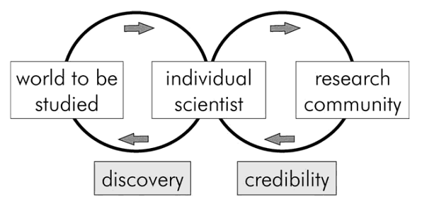
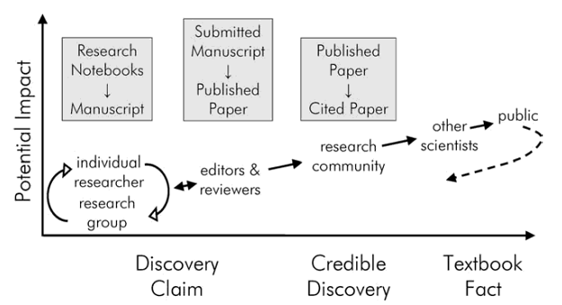
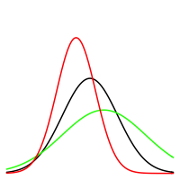

## Algunas tendencias
1. NYT 2009, "I keep saying that the sexy job in the next 10 years will be statisticians," said Hal Varian, chief economist at Google. "And I'm not kidding."

2. FORBES 2014, Estadistico es uno de los 10 mejores trabajos. Salary: $75,560, Projected job growth (between 2012 and 2022): 27%
3. Algunas cifras en US [Aquí](http://www.payscale.com/research/US/Job=Statistician/Salary).

## Algunos hechos en Bolivia
1. La cantidad de profesionales en Estadistica no supera el total de Municipios en el País
2. El número de titulados y estudiantes de nuevo ingreso es uno de los mas bajos en la UMSA   
3. En el INE La proporción de estadísticos en cargos técnicos o directivos no supera el 5\%
4. (Opinión) No hay estandares de calidad establecidos, ni regulados, ni criticados enfaticamente. Ejemplo: Cualquier consultora (Mercado de limones).
5. No existe la posibilidad de especialización (Diplomados, maestrias y doctorados)

## La evolucion de la Estadística
Tres fases:

1. Del descubrimiento; con la estadística descriptiva y los usos en los censos y las guerras, 
2. La era predictiva; con la inferencia estadística y sus usos en las encuestas, los experimentos, la operativa, las series de tiempo y los modelos de supervivencia, 
3. La explosión de conocimiento; con el uso de la bayesiana, las estadística multivariante (Asociada a la velocidad y capacidad de las computadoras)

##Redes Internacionales

* American Statistical Association (ASA) 
* International Statistical Institute (ISI)
* International Social Survey Programme (ISSP)
* The world of statistics 
* International Association for Official Statistics (IAOS)
* International Society for Business and Industrial Statistics (ISBIS)
* International Association of Survey Statisticians (IASS)
* International Association for Statistical Computing (IASC)
* The International Environmetrics Society (TIES)
* International Association for Statistical Education (IASE)
* Bernoulli Society (BS)
* Oficina de Estadística de las Naciones Unidas

##Instituciones Nacionales 

* Nexo directo
    + Instituto Nacional de Estadística
    + Carreras de Estadistica UMSA, Tomas Frias
    + IETA?
    + Centro de Estadística Aplicada (CEA)
* Nexo indirecto
    + ONG
    + Fundaciones
    + Consultoras
    + Público (Univeridades, Munisterios, Gobernaciones y Municipios)
    + etc...
 
# Las condiciones para crear un centro de investigación son favorables, en el entendido que el mercado actual es mediocre, carece de objetivos claros y/o son pasivos

## Visión y Misión

\section{Visión y misión}

###La visión:

***Convertirse en un centro de referencia nacional e internacional sobre la investigación aplicada y teórica de la estadística. A partir de la contribución a la toma de decisiones en ámbitos políticos, sociales y académicos provenientes de investigaciones estadísticas rigurosas***

###La misión:

***Generar investigación de calidad y espacios de debate informado a partir del uso de la estadística***

## Metas
* Corto Plazo
    + Definir nuestra identidad
    + Generar investigaciones (agenda)
    + Lograr las membresias (presentarse)
* Mediano Plazo
    + CLATSE 2018
    + ISI 2017
    + SOBOE
* Largo Plazo
    + Institucionalizar 
    
## Pendientes (Camino protocolar)
Definir:

1. Los objetivos y nuestros principios
2. Integrantes y roles
3. Estructura organizativa
4. Governanza
5. Agendas de Investigación

## Posibles iniciativas 

* Sociedad Boliviana de Estadísticos
* Conversatorios
* Sellos de calidad
* Cursos y Talleres de investigación
* Alfabetización de datos (Programa radial, televisivo, redes sociales)
* Congresos

## Agenda Urgente

* Gente comprometida y nivel de participación
* Homolagar criterios y herramientas
    + Capacitaciones
* Definir Agenda y responsables (plan)
* Pagina Web y redes
* Peer review
* Infraestructura

## Práctica de la ciencia
##### Frederick Grinnel

## Proceso de Credibilidad
##### Frederick Grinnel

## La ciencia de los datos 
##### Drew Conway's,

# Gracias!!! 

Alvaro Chirino,

Contacto: [achirino@aru.org.bo](mailto:achirino@aru.org.bo)

## Acerca de Mi

* Cursos: 
    - Introduction to Structural Equation Modeling, WSC 2015, Brasil
    - Advanced Topics in Survey Sampling, WSC 2015, Brasil
    - Evaluación de Impacto, CEDLAS-GRADE, Peru, 2014
    - Evaluación de Impacto, CEDLAS-GRADE, Argentina, 2014
    - Taller para Investigadores Jóvenes, CIES, Peru, 2013
    - The Economic contributions of Women and men: A training Workshop on time-use data analysis for policymaking, Brasil, 2013

## Acerca de Mi

* Congresos   
    - (Expositor y participante) 60th World Statistics Congress, Brasil-Julio 2015.
    - (Participante) The Political Economy of the Extractive Imperative in Latin America, Den Haag-Netherlands , Abril 2015
    - (Expositor y participante) VI Congreso de la Asociación Latinoamericana de Población, Peru-Agosto 2014.
    - (Expositor y participante) 35th Conference of the International Association for Time Use Research, Brasil-Agosto 2013

## Acerca de Mi

* Reconocimientos
    - International Development Research Centre (IDRC), 50000 \$ CAD, Proyecto ``Red Boliviana de Microdatos y Encuestas'', Coordinador Técnico.
    - The Partnership for Economic Policy (PEP), 2do Lugar ``Best Practice Awards'', 2014, 6000\$ CAD, Toward a Community-based Monitoring System for Santa Cruz de la Sierra, Bolivia 

